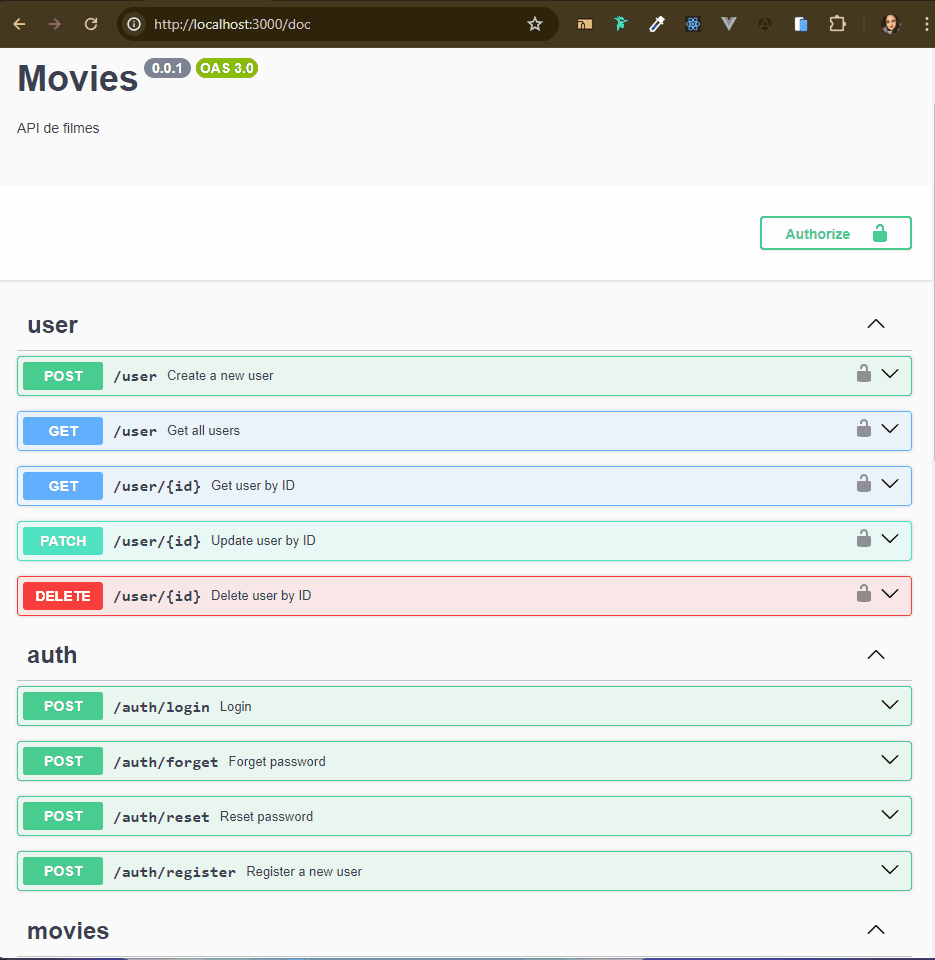

<p align="center">
  <a href="http://nestjs.com/" target="blank"></a>
</p>


## Description
A backend project for a movie catalog using NestJS, TypeScript, Docker, Redis, Swagger, Jest, ESLint, Prettier, Husky, Lint-staged, TypeORM, and PostgreSQL.

## Table of Contents

- [Overview](#overview)
- [Installation](#installation)
- [Configuration](#configuration)
- [API Documentation](#api-documentation)
- [Contributing](#contributing)
- [License](#license)

## Overview

This project is a backend for a movie catalog that allows users to register, authenticate, search for movies, and save their favorite movies. It is developed using the NestJS framework with TypeScript and several other tools to ensure code quality and scalability.

## Installation

To install and run the project locally, follow the steps below:

### Prerequisites

- Node.js (version 20 or higher)
- NPM or Yarn
- Docker and Docker Compose


### Steps
1. Clone the repository:

! The project is using git submodules, therefore need use the "--recurse-submodules"

 ```bash
    git clone --recurse-submodules https://github.com/Daaaiii/mks-backend-challenge.git

   cd mks-backend 
   ```
2. Install the dependencies:
```bash
$ npm install
```

3. Create a '.env' file (use the .env-example to see which variables need be created):
```
 cp .env.example .env
```

4. Running the app:

```bash
# Running docker
$ docker compose up -d

# Applying migrations
$ npm run migrate:up

# Development mode
$ npm run dev
```

## API Documentation
The API documentation is available via Swagger. After running the application, access:
```
http://localhost:3000/doc
```

## Contributing

Contributions are welcome! To contribute, follow these steps:

Fork the project.
Create a branch for your feature (git checkout -b feature/new-feature).
Commit your changes (git commit -am 'Add new feature').
Push to the branch (git push origin feature/new-feature).
Create a new Pull Request.

## License
This project is licensed under the MIT License - see the LICENSE file for details.